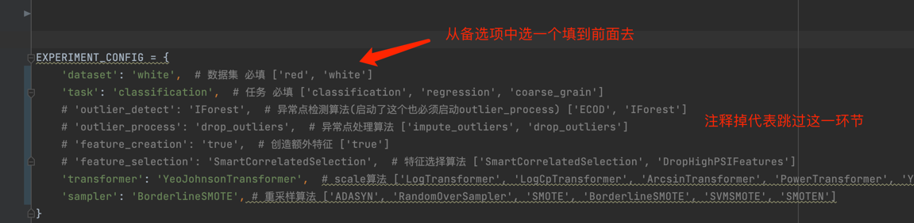
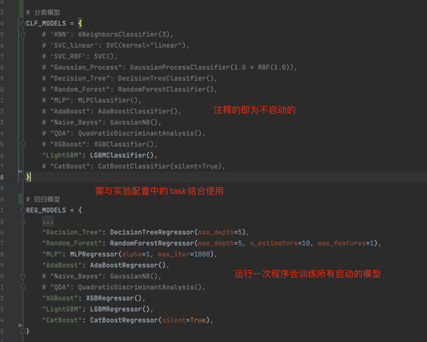

# ST5188 Group 17
## 环境
- **python版本**: 3.8
- 库：在本文件夹下运行 `pip install -r requirements.txt`
## 运行实验
`python main.py`
## 实验配置
### EXPERIMENT_CONFIG

### CLF_MODELS 和 REG_MODELS

## 运行超参搜索
`python hyper_parameters_tunning.py`